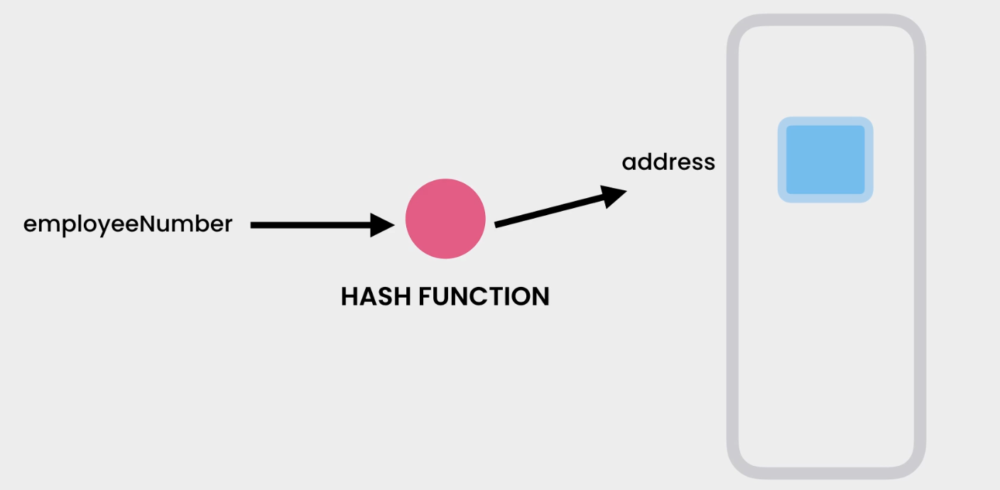
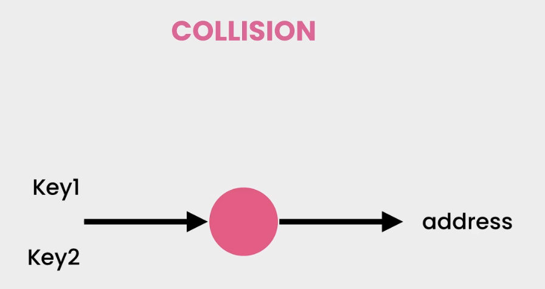
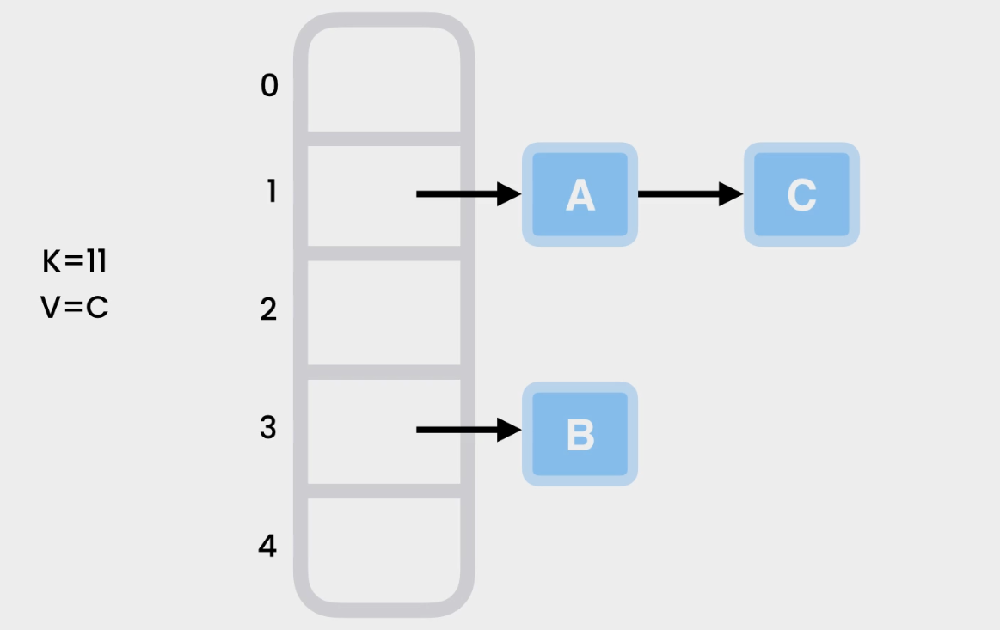
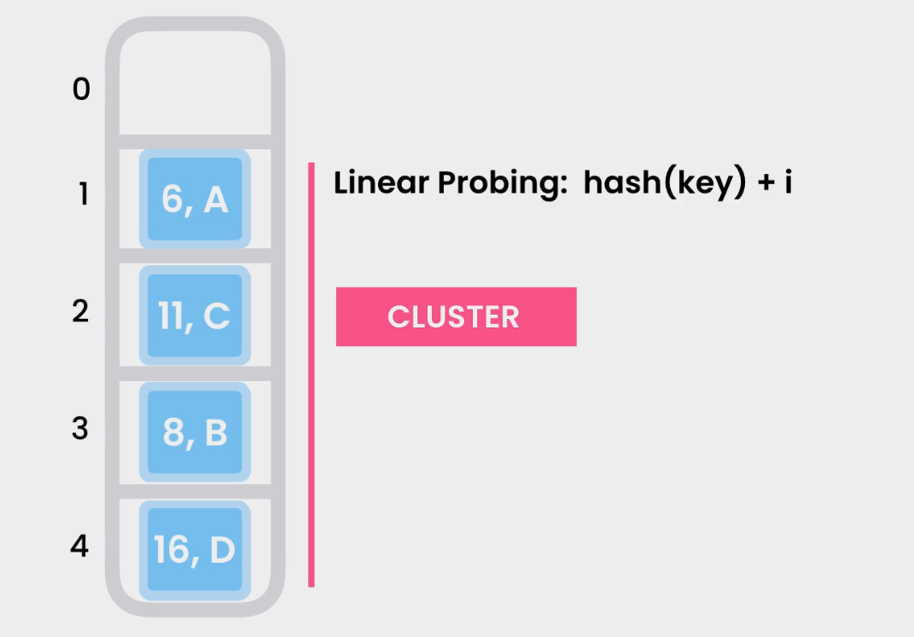
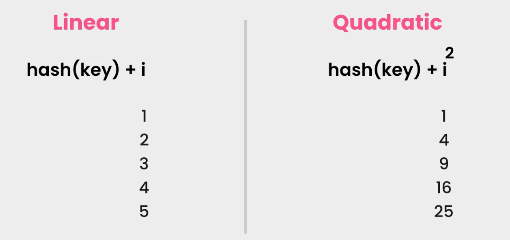
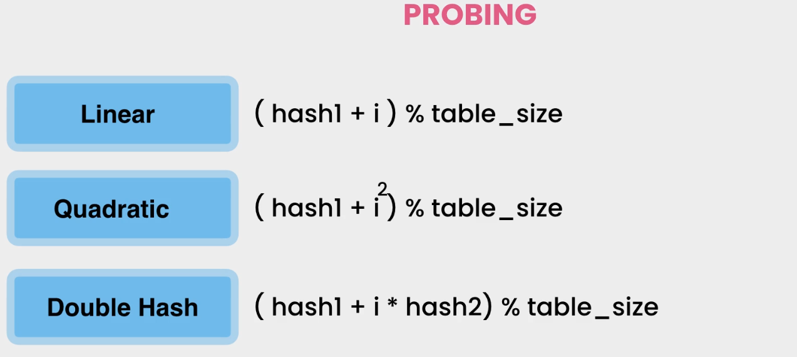

## Applications

- **Spell checkers**: quickly look up a word amongst tens of thousands of words in less than a second
- **Dictionaries**: quickly look up a word and find it's translation in another language
- **Compilers**: quickly look up the address of functions and variables
- **Code editors**: literally anywhere you want to look up an item super fast

## Implementations in different languages

|  language  | Implementation |
| :--------: | :------------: |
|    Java    |    HashMap     |
| JavaScript |     Object     |
|   Python   |   Dictionary   |
|     C#     |   Dictionary   |

## Overview

## Operations

| Operation | Complexity |
| :-------: | :--------: |
|  Insert   |   $O(1)$   |
|  Lookup   |   $O(1)$   |
|  Delete   |   $O(1)$   |

## Collisions

- **Chaining**

- **Open Addressing**

## Summary

- To store key/value pairs

- Insert, remove, lookup in $O(1)$

- Hash function

- Collision

   - Chaining
   
  - Open addressing
  
    
