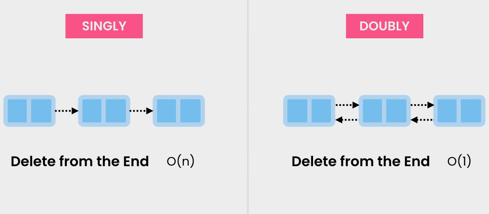
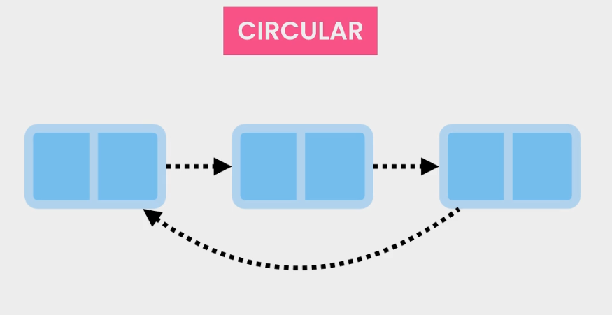
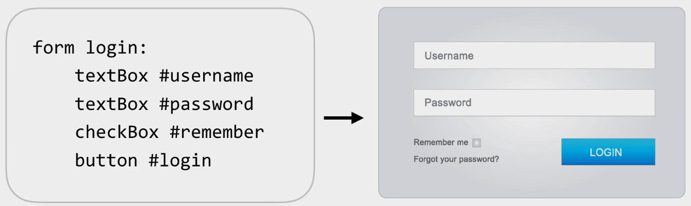

## Space

- Static arrays have a fixed size
- Dynamic arrays grow by 50-100%
- Linked lists don't waste memory
- Use arrays if you know the number of items to store
- new ArrayList(100)

## Runtime complexity

|  Lookup  |      |    Insert     |      |  Delete   |      |
| :------: | :--: | :-----------: | :--: | :-------: | :--: |
| By Index | O(n) | Beginning/End | O(1) | Beginning | O(1) |
| By Value | O(n) |    Middle     | O(n) |  Middle   | O(n) |
|          |      |               |      |    End    | O(n) |

## Singly & Doubly

## Circular

**Application:**

- music playlist
- 

## Summary

- Second most used data structures after array
- Grow and shrink automatically
- Take a bit more memory(reference to next or/and previous node)

