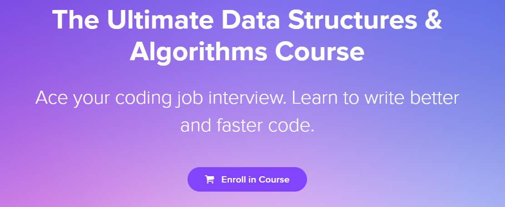

# The-Ultimate-Data-Structures-Algorithms

> One of the most comprehensive data structures and algorithms course online, packed with popular interview questions asked by Google, Microsoft, Amazon and other big companies,
>
> designed by <a href="https://github.com/mosh-hamedani">Mosh Hamedani</a>, and is divided into three Parts, which you can buy any part of it on <a href="https://codewithmosh.com/p/data-structures-algorithms">Code with Mosh</a>.

**Course outline:**

| [Part I](https://codewithmosh.com/p/data-structures-algorithms-part1) | [Part II](https://codewithmosh.com/p/data-structures-algorithms-part-2) | [Part III](https://codewithmosh.com/p/data-structures-algorithms-part-3) |
| :----------------------------------------------------------: | :----------------------------------------------------------: | :----------------------------------------------------------: |
|                        Big O Notation                        |                         Binary Trees                         |                     Searching Algorithms                     |
|                            Arrays                            |                          AVL Trees                           |                      Sorting Algorithms                      |
|                         Linked Lists                         |                            Heaps                             |                String Manipulation Algorithms                |
|                            Stacks                            |                            Tries                             |                                                              |
|                            Queues                            |                            Graphs                            |                                                              |
|                         Hash Tables                          |                                                              |                                                              |

## Source code

I am currently working on this course, constantly maintain this repo, besides the Java source code in the course, I am also trying to implement every data structure and algorithm in c++, please feel free to **pull request** and submit a **issue**.

## Folder clarification

The folder names should generally be self-explanatory and consists of four parts: **Java** for original java code, **cpp** for c plus plus-implemented code, one **README** for notes(Extracted from the course) and one **Exercises** pdf.

## Progress

- [x] <a href="01-Arrays">Arrays</a>

- [x] <a href="02-Linked Lists">LinkedLists</a>

- [x] <a href="03-Stacks">Stacks</a>

- [x] <a href="04-Queues">Queues</a>

- [ ] <a href="05-Hash Tables">Hash Tables</a>

## Commit Messages

All git emojis come from <a href="https://gitmoji.dev/">here</a>

## Copyright

For any materials related to my work, for example **cpp-implemented code** and **Notes** are licensed under MIT, for the others, please contact the <a href="https://github.com/mosh-hamedani">original author</a>.
